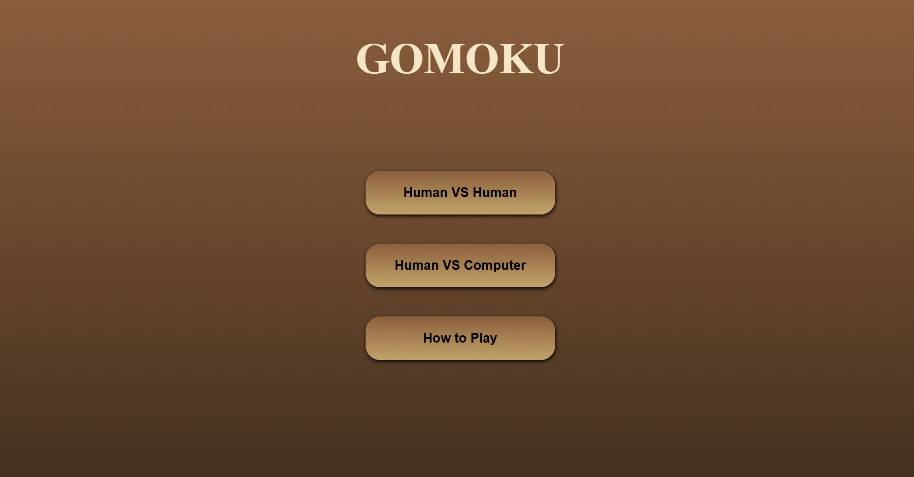
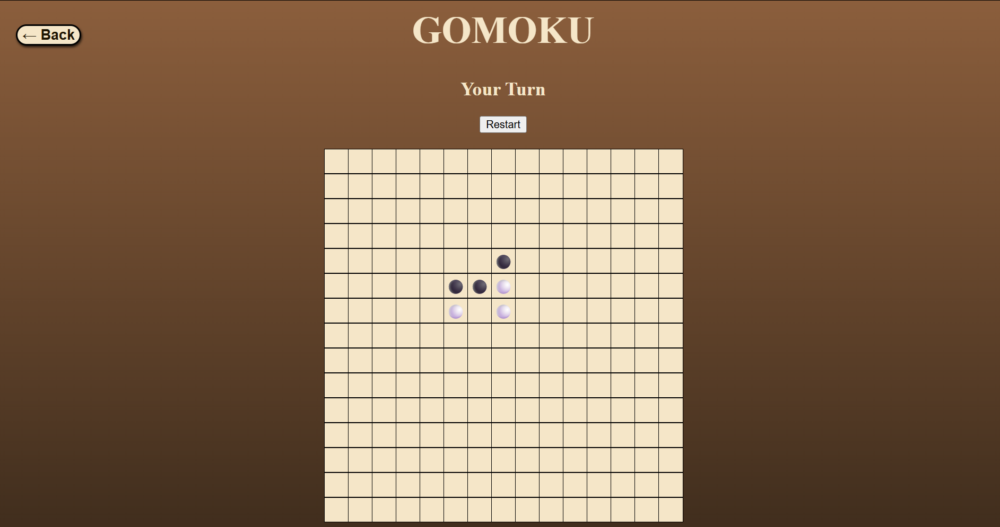
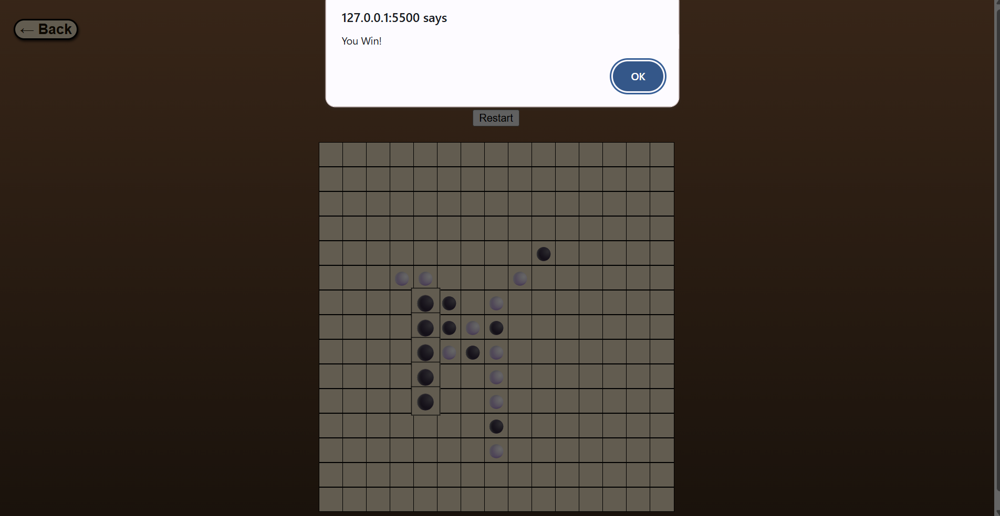

# Gomoku AI Game

A browser-based Gomoku game built using HTML, CSS, and JavaScript featuring both Human vs Human and Human vs Computer gameplay modes with an AI opponent, sound effects, animated UI, and strategic gameplay mechanics.

---

# Overview

This project is a full-stack style front-end game application focused on game logic implementation, AI move evaluation, user interaction, and responsive UI design.

The game includes:
- Human vs Human mode
- Human vs Computer mode
- AI move evaluation system
- Win detection system
- Dynamic game board rendering
- Sound effects and background music
- Interactive UI animations
- Restart and navigation controls

---

# Features

## Gameplay Modes
- Human vs Human
- Human vs Computer (AI)

## AI System
- Offensive and defensive move evaluation
- Win prediction logic
- Double-threat detection
- Future move scoring
- Center-control prioritization
- Candidate move optimization

## User Interface
- Interactive 15x15 Gomoku board
- Animated winning highlights
- Modern UI styling
- Responsive controls
- Hover and click effects

## Audio System
- Background music
- Move sound effects
- Hover sound effects
- Win sound effects

---

# AI Logic Highlights

The AI opponent was designed using heuristic evaluation techniques instead of random move generation.

Key AI strategies include:

- Immediate win prioritization
- Threat blocking
- Open four / open three detection
- Double-threat creation
- Future attack prediction
- Center board control

The AI evaluates both:
- Offensive opportunities
- Defensive threats

to produce more competitive gameplay.

---

# Tech Stack

## Frontend
- HTML5
- CSS3
- JavaScript (ES6 Modules)

## Game Logic
- Custom board state management
- Win condition algorithms
- Heuristic AI evaluation system

## Audio
- HTML Audio API

---

# Project Structure

```bash
project/
│
├── gomoku_html/
│   ├── index.html
│   ├── humanPage.html
│   └── computerPage.html
│
├── gomoku_js/
│   ├── general.js
│   ├── humanPage.js
│   ├── computerPage.js
│   └── sound.js
│
├── gomoku_css/
│   ├── general.css
│   └── menuPage.css
│   
│
├── gomoku_music/
│   ├── click_sound.wav
│   ├── hover_sound.wav
│   ├── win.mp3
│   └── gomoku_relax_bgm.mp3
```

---

# Screenshots

## Main Menu




## Human vs Computer Gameplay



## Winning Animation



---

# Live Demo

To view gameplay demonstrations and project showcases, please visit my LinkedIn profile:

```text
https://www.linkedin.com/in/siao-yi-yee-a933b2342/
```

---

# How to Play

## Goal
Connect 5 stones in a row:
- Horizontally
- Vertically
- Diagonally

## Rules
- Black stone plays first
- White stone plays second
- First player to connect five stones wins

---

# Installation

Clone the repository:

```bash
git clone https://github.com/yeesiaoyi-stack/gomoku-ai-game.git
```

Open the project folder:

```bash
cd gomoku-ai-game
```

Run using Live Server or open `index.html` directly in your browser.

---

# Future Improvements

Planned upgrades include:

- Minimax AI implementation
- Alpha-beta pruning optimization
- Online multiplayer mode
- Difficulty selection
- Mobile responsiveness improvements
- Game replay system
- Timer mode
- Player ranking system

---

# What I Learned

Through this project, I gained experience with:

- JavaScript game architecture
- AI heuristic evaluation
- State management
- DOM manipulation
- Event-driven programming
- Game UI/UX design
- Modular JavaScript structure
- Audio integration in web applications

---

# GitHub Repository

```text
https://github.com/yeesiaoyi-stack/gomoku-ai-game
```

---

# Author

YEE SIAO YI

GitHub:
https://github.com/yeesiaoyi-stack

LinkedIn:
https://www.linkedin.com/in/siao-yi-yee-a933b2342/
